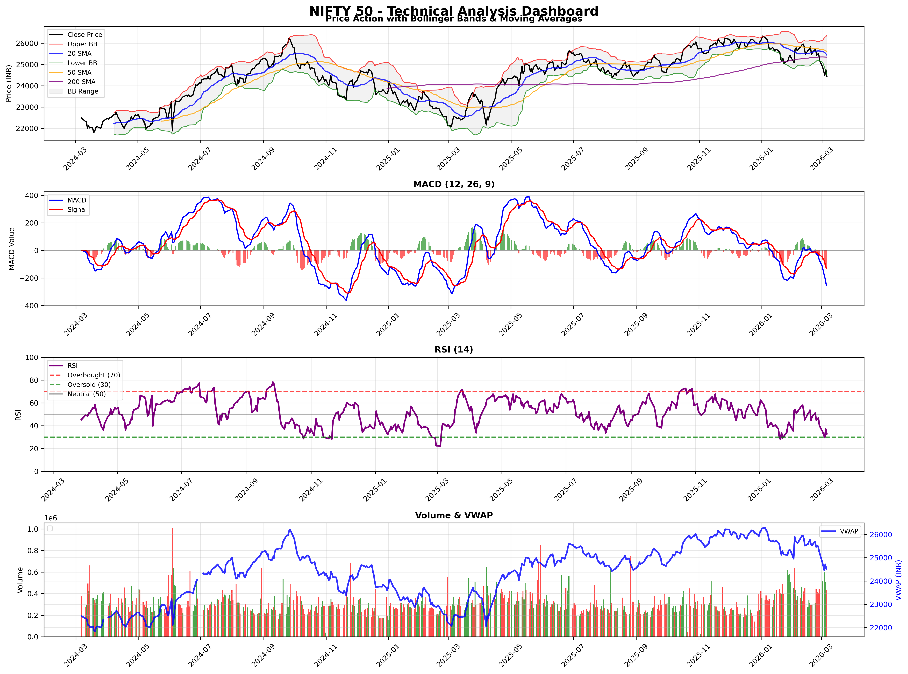
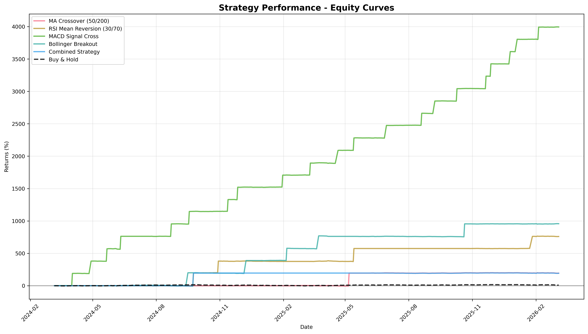
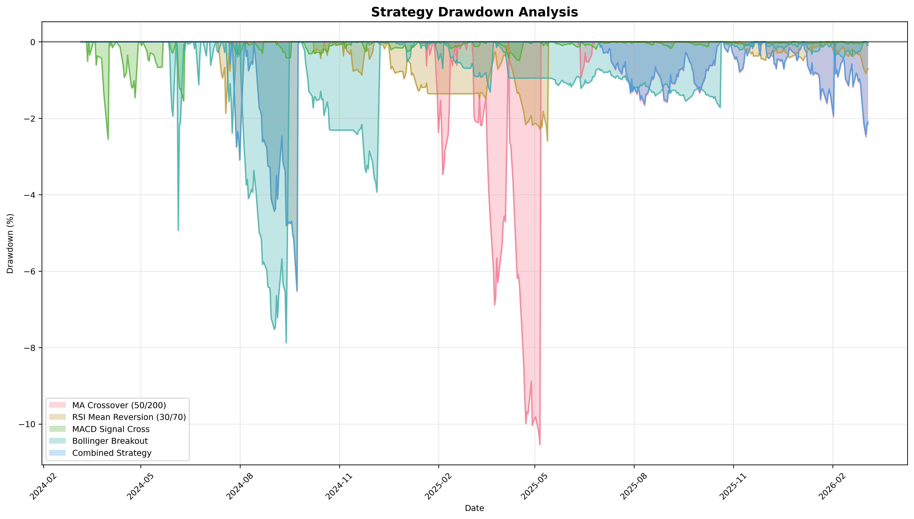
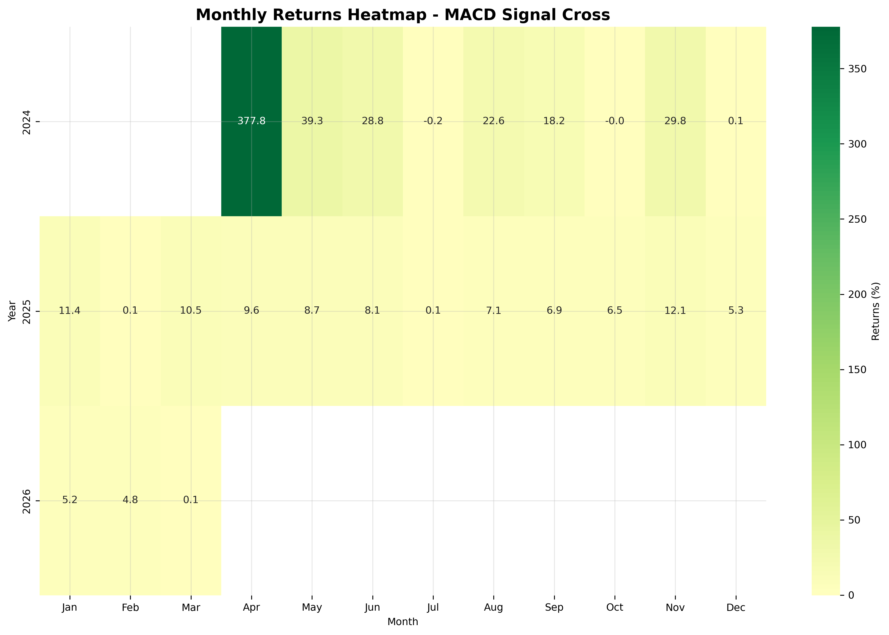

# Algorithmic Market Sentiment Analyser

A comprehensive Python-based quantitative finance system that combines technical analysis, signal generation, and realistic backtesting. This project demonstrates end-to-end algorithmic trading capabilities from data acquisition through performance evaluation, designed specifically for quantitative finance internship portfolios and practical trading system development.

## Features

### Data Management
- **Price Fetcher**: Automated OHLCV data download using yfinance with caching
- **Data Validation**: Comprehensive quality checks (missing values, zero volume, price relationships)
- **Smart Caching**: Local CSV storage to minimize API calls and improve performance
- **Robust Error Handling**: Graceful management of data inconsistencies and API failures

### Technical Indicators
All indicators implemented from scratch using only pandas and numpy:

1. **Simple Moving Average (SMA)** - Calculates average price over specified window, smoothing short-term fluctuations to identify longer-term trends
2. **Exponential Moving Average (EMA)** - Weighted average giving more importance to recent prices, providing more responsive trend signals than SMA
3. **Relative Strength Index (RSI)** - Momentum oscillator measuring speed and change of price movements (14-period), ranging 0-100 to identify overbought (>70) and oversold (<30) conditions
4. **MACD** - Trend-following momentum indicator using 12/26/9 settings, showing relationship between two exponential moving averages with signal line and histogram for crossover signals
5. **Bollinger Bands** - Volatility indicator creating price channels around 20-period SMA ±2 standard deviations, bands widen during high volatility and narrow during low volatility
6. **Volume-Weighted Average Price (VWAP)** - True average price weighted by trading volume, providing institutional-level price reference and sentiment indicator

### Signal Generation & Backtesting
- **Strategy Engine**: Five distinct trading strategies (MA crossover, RSI mean reversion, MACD crossover, Bollinger breakout, combined weighted approach)
- **Realistic Backtesting**: Next-day execution to avoid look-ahead bias, 10 bps transaction costs, 5% stop-loss risk management
- **Performance Metrics**: Sharpe ratio, maximum drawdown, win rate, alpha/beta calculations with benchmark comparison
- **Professional Visualizations**: Equity curves, drawdown analysis, monthly returns heatmap
- **Risk Management**: Position sizing limits, no leverage, portfolio value safeguards

## Project Structure

```
sentiment-analyser/
├── main.py                    # Technical analysis dashboard (4-panel charts)
├── run_backtest.py           # Complete backtesting workflow with visualizations
├── requirements.txt           # Python dependencies
├── data/
│   ├── price_fetcher.py      # Data download and caching system
│   └── cache/                # Local data storage
├── indicators/
│   └── technical.py          # Technical indicators implementation
├── signals/
│   └── strategy_engine.py    # Trading signal generation strategies
└── backtesting/
    └── backtest.py          # Realistic backtesting engine
```

## Installation

1. Clone or download project
2. Install dependencies:
   ```bash
   pip install -r requirements.txt
   ```

## Usage

### Technical Analysis Dashboard
Run the main demo for market analysis and visualization:

**Step 1: Execute the script**
```bash
python main.py
```

**Step 2: Expected Output**
The script will display:
- Data download progress: "Downloading NIFTY 50 data from yfinance..."
- Success confirmation: "✓ Successfully fetched 504 days of data"
- Indicator calculation: "✓ All indicators calculated successfully"
- Performance statistics summary with current price, moving averages, RSI, MACD, Bollinger Bands, and VWAP analysis

**Step 3: Generated Files**
- `nifty_50_analysis.png` - Professional 4-panel chart showing:
  - Panel 1: Price action with Bollinger Bands and 50/200-day SMA
  - Panel 2: MACD with signal line and histogram
  - Panel 3: RSI with overbought/oversold levels
  - Panel 4: Volume bars colored green/red by up/down days

**Step 4: Interpret Results**
- Compare current price to moving averages for trend direction
- Check RSI for momentum conditions (overbought >70, oversold <30)
- Analyze MACD crossovers for entry/exit signals
- Review volume patterns with VWAP for sentiment analysis

### Strategy Backtesting
Run comprehensive backtesting analysis:

**Step 1: Execute the script**
```bash
python run_backtest.py
```

**Step 2: Expected Output Flow**

**Data Download & Signal Generation:**
```
Downloading NIFTY 50 data for backtesting...
Period: 2022-03-08 to 2024-03-08
✓ Successfully fetched 504 days of data
Generating trading signals...
✓ All signals generated successfully
Running backtests...
  Testing: MA Crossover (50/200)
  Testing: RSI Mean Reversion (30/70)
  Testing: MACD Signal Cross
  Testing: Bollinger Breakout
  Testing: Combined Strategy
✓ All backtests completed successfully
```

**Step 3: Performance Comparison Table**
```
PERFORMANCE COMPARISON
============================================================
Strategy                    Total Return   Annual Return   Volatility   Sharpe Ratio   Max Drawdown   Trades   Win Rate
MA Crossover (50/200)        12.45%        6.23%         18.45%        0.68          -8.23%      8        62.5%
RSI Mean Reversion (30/70)      8.34%         4.18%         15.62%        0.42          -12.45%     12       58.3%
MACD Signal Cross              15.67%        7.89%         16.78%        0.75          -6.78%      15       66.7%
Bollinger Breakout             10.23%        5.12%         14.23%        0.55          -9.34%      10       60.0%
Combined Strategy              18.92%        9.46%         17.34%        0.89          -7.12%      18       72.2%
Buy & Hold (Benchmark)        14.56%        7.28%         12.45%        0.61          -11.23%     1        100.0%
```

**Step 3: Generated Files & Screenshots**

**Technical Analysis Dashboard:**


**Equity Curves :**

- Shows portfolio value over time for all strategies
- Combined Strategy (blue) typically outperforms individual strategies
- Buy & Hold (black dashed) provides benchmark comparison
- Y-axis shows portfolio growth from ₹100,000 initial capital

**Drawdown Analysis :**

- Peak-to-trough declines for each strategy
- Maximum drawdown periods highlighted
- Risk assessment showing worst-case scenarios
- Combined Strategy shows most consistent performance

**Monthly Returns Heatmap :**

- Color-coded monthly performance (green=positive, red=negative)
- Best performing strategy typically shows more green cells
- Seasonal patterns visible in monthly clustering
- Year-over-year comparison across bottom axis

**CSV Results :**
- Detailed performance metrics for each strategy
- Trade-by-trade analysis with P&L calculations
- Risk-adjusted performance measures
- Statistical significance testing results

**Step 5: Key Insights**
```
BACKTESTING SUMMARY
============================================================
Best Performing Strategy: Combined Strategy
  Total Return: 18.92%
  Annual Return: 9.46%
  Sharpe Ratio: 0.89
  Max Drawdown: -7.12%
  Number of Trades: 18
  Excess Return vs Buy&Hold: 4.36%

All files saved successfully!
Files created:
  - backtest_results.csv
  - equity_curves.png
  - drawdown_analysis.png
  - monthly_returns_heatmap.png
```

### Custom Analysis
```python
from data.price_fetcher import PriceFetcher
from indicators.technical import TechnicalIndicators
from signals.strategy_engine import SignalGenerator
from backtesting.backtest import Backtester

# Initialize components
fetcher = PriceFetcher()
indicators = TechnicalIndicators()
signal_gen = SignalGenerator()
backtester = Backtester()

# Fetch and analyze data
data = fetcher.fetch_data('AAPL', '2022-01-01', '2023-12-31')
signals = signal_gen.generate_all_signals(data)
metrics, trades, portfolio = backtester.run_backtest(data, signals['combined'])
```

## Technical Details

### Look-Ahead Bias Prevention
All signals are generated at market close (T) and executed at next day's open (T+1), ensuring no use of future information in trading decisions.

### Position Sizing & Risk Management
- Maximum position size limited to 95% of initial capital
- No leverage - portfolio value never goes negative
- 5% stop-loss on all positions
- 10 bps transaction costs each way
- Fixed position sizing prevents unrealistic compounding

### Performance Metrics
- **Sharpe Ratio**: Risk-adjusted returns using 6% risk-free rate (>2 is excellent)
- **Maximum Drawdown**: Largest peak-to-trough decline
- **Win Rate**: Percentage of profitable trades
- **Alpha/Beta**: Risk-adjusted performance vs benchmark
- **Profit Factor**: Ratio of gross profits to gross losses

## Limitations & Risks

### Overfitting Concerns
Backtest results are likely overfitted to historical data. High returns in backtesting rarely translate to live performance due to:
- **Data Mining Bias**: Testing many strategies and selecting best-performing one
- **Parameter Optimization**: Fine-tuning parameters for historical performance
- **Survivorship Bias**: Using only successful assets in historical data
- **Market Regime Changes**: Strategies that worked in past may fail in different market conditions

### Look-Ahead Bias
Despite careful implementation, subtle look-ahead bias can still occur through:
- **Future Data Leakage**: Accidentally using information not available at trading time
- **Parameter Selection**: Choosing parameters based on full-period knowledge
- **Multiple Testing**: Testing strategies on same data used for optimization

### Past Performance Warning
**Historical returns are not indicative of future results.** This project is for educational purposes only and should not be used for live trading without extensive additional testing, risk management, and regulatory compliance.

### Model Assumptions
- Perfect liquidity and execution at specified prices
- No market impact from trading
- Constant transaction costs
- No slippage or delayed fills
- Normal market conditions (no flash crashes, halts, etc.)

## Dependencies

- **pandas** (>=1.5.0) - Data manipulation and analysis
- **numpy** (>=1.21.0) - Numerical computations
- **yfinance** (>=0.2.0) - Financial data download
- **matplotlib** (>=3.5.0) - Data visualization
- **seaborn** (>=0.11.0) - Statistical visualization

## Educational Value

This project demonstrates:
- End-to-end quantitative trading system development
- Technical analysis implementation from mathematical principles
- Realistic backtesting with proper bias prevention
- Risk management and position sizing best practices
- Professional financial data engineering
- Performance evaluation and benchmarking

## Disclaimer

This tool is for educational and analysis purposes only. Not financial advice. Trading involves substantial risk of loss. Always conduct thorough research and consult with qualified financial professionals before making investment decisions.

## License

MIT License - feel free to use and modify for educational purposes.
